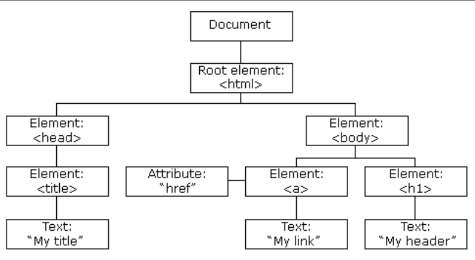

# Hack School: Part 3 - DOM Manipulation, React (10/29)

Slides Link: (__insert-link-here_)

Workshop Recording: (__insert-link-here__)

Repl Link: (__insert-link-here__)


In the first part of this workshop, we learned about DOM and React. Specifically, we learned **how to access elements using JavaScript and DOM**, **the difference between React and HTML**, **components**, and **props**.

We used these ideas to to:
- [x] Pull starter code for this workshop
- [x] Write components in NavBar, TextBox and MemeGenerator
- [x] Change the style in NavBar
- [x] Add components to TextBox and LikeButton


## What is DOM?



DOM is the tree structure that organizes HTML elements. JavaScript uses the DOM organization to access HTML elements--like how you might use an address to find a location.

In Hack School, we will be using DOM to animate and modify the Pokemon Generator with JavaScript.


### Main Idea 1

Main Idea 1 is (explanation).

Some examples of Main Idea 1 are:

#### `(Code Command #1)`

`Code Command #1` is a (insert descriptor here). It takes (input) and (does output).

```
example code here
```


## Project Implementation

### Task 1

We want to do (insert task here) for our Pokemon generator.

For that, we use **main idea 1** and **main idea 2**.

```
example code here
```

<details> 
  <summary> Hint #1: </summary>
   Try doing this: <code> code </code>
</details>

## What is [Workshop Name]?

[Workshop Name] is (insert general description here). It is used for (general purpose).

In Hack School, we will be using [Tool 1] to (purpose for project).


### Main Idea 1

Main Idea 1 is (explanation).

Some examples of Main Idea 1 are:

#### `(Code Command #1)`

`Code Command #1` is a (insert descriptor here). It takes (input) and (does output).

```
example code here
```


## Project Implementation

### Task 1

We want to do (insert task here) for our Pokemon generator.

For that, we use **main idea 1** and **main idea 2**.

```
example code here
```

<details> 
  <summary> Hint #1: </summary>
   Try doing this: <code> code </code>
</details>

## Simple Resources:

**Main Idea 1**:

Site #1: (link)

Site #2: (link)
